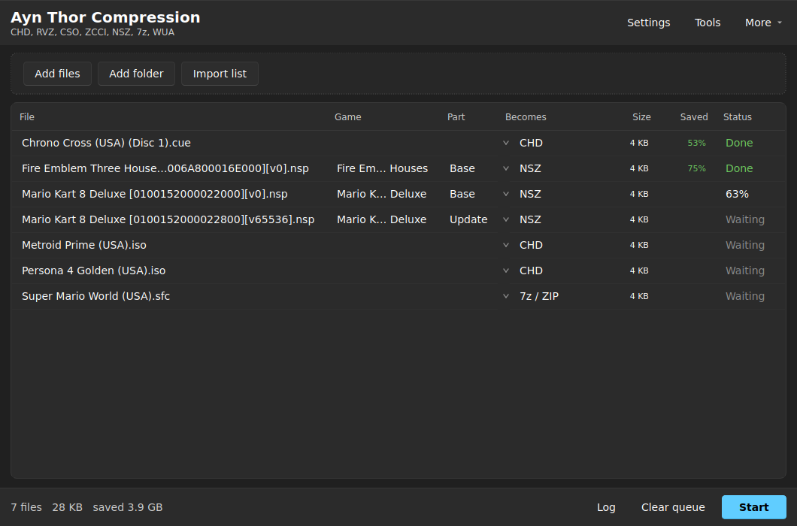
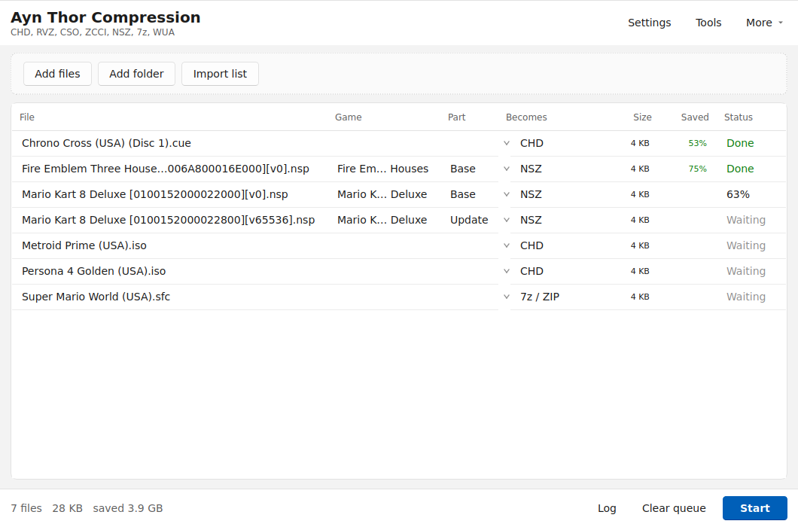
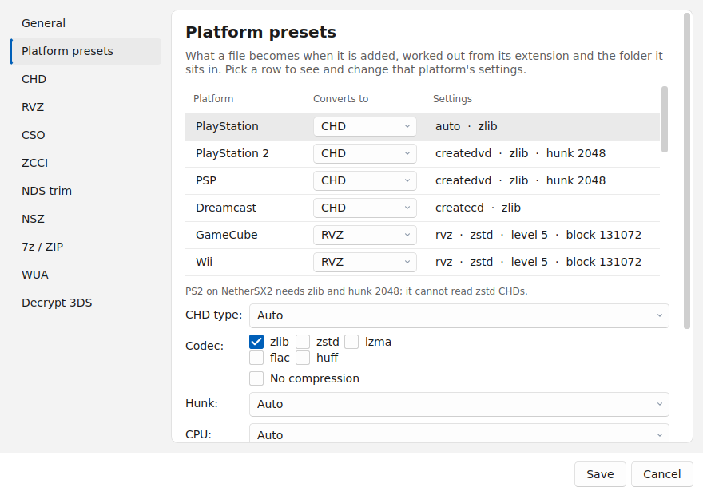
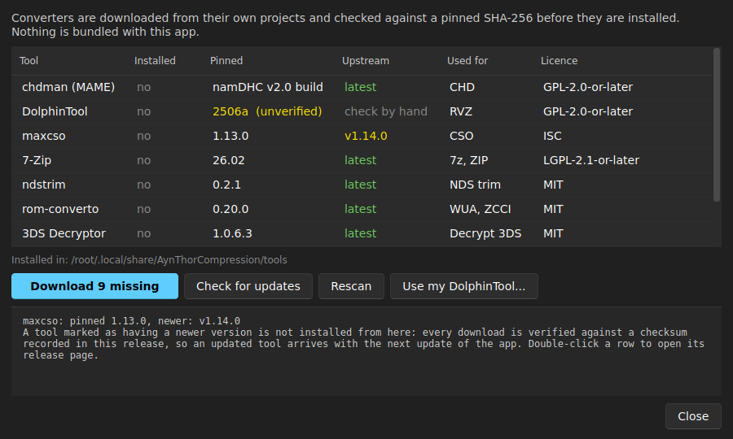

# Ayn Thor Compression

[](https://github.com/asa07-salihg/Ayn-Thor-Compression/actions/workflows/ci.yml)
[](https://github.com/asa07-salihg/Ayn-Thor-Compression/releases/latest)

Ayn Thor Compression is a Windows desktop front end for the ROM compression
tools that emulators expect. Every system wants a different format and a
different program to produce it: CHD comes from chdman, RVZ from DolphinTool,
NSZ from nsz, and the 3DS needs its ROMs decrypted before compression saves
anything at all. This app puts one queue in front of all of them, picks the
format each file should become, and runs the batch.

It converts nothing itself. Each format is handled by the project that defined
it, driven with the flags that particular emulator actually needs.

Built for filling an [Ayn Thor](https://www.ayntec.com/) handheld, which is
where the per-platform defaults come from, and it works the same on every model
in the range. Nothing in it is tied to one device: the defaults are the formats
and flags each emulator needs, and every one of them is visible and editable
under **Settings > Platform presets**.

[Download](#download) · [Formats](#supported-formats) · [Legal](#legal) · [From source](#running-from-source)



The format for each file is worked out when it is added. Click the **Becomes**
cell to change it, or right-click for the same list plus everything else a row
can do. There is no mode to be in and nothing to select first: drop a folder in
and press Start.

Light and dark follow the Windows setting, and the accent colour comes from
yours:



## Legal

- No ROMs, console keys or copyrighted game data are distributed with this
  project, and none are downloaded by it.
- Nintendo Switch support needs a `prod.keys` file that you dump from a console
  you own. The app never ships one, never fetches one, and never uploads one.
  See [SECURITY.md](SECURITY.md).
- The 3DS decryption step removes encryption from files you already have. It
  does not break any protection on a device and does not obtain anything.
- Use this on games you own.

## Download

Get `AynThorCompression.exe` from
[Releases](https://github.com/asa07-salihg/Ayn-Thor-Compression/releases/latest)
and run it. There is no installer and no Python to set up.

Each release is built by GitHub Actions from the tagged source and published
with a `SHA256SUMS.txt` next to it, so you can check what you downloaded:

```powershell
Get-FileHash .\AynThorCompression.exe -Algorithm SHA256
```

The exe is not code-signed, so SmartScreen will warn on first run.

## Supported formats

| Format | Systems | Produced by | Why this one |
|---|---|---|---|
| **CHD** | PS1, PS2, PSP, Dreamcast | chdman | One file instead of a cue/bin pair, and every mainstream disc emulator reads it |
| **RVZ** | GameCube, Wii | DolphinTool | Drops the junk padding Nintendo discs are full of; GCZ and WBFS keep it |
| **CSO / ZSO** | PSP, PS2 | maxcso | Smaller than CHD on PSP, and PPSSPP reads it natively |
| **ZCCI** | Nintendo 3DS | rom-converto | The only compressed 3DS format Azahar loads directly |
| **NSZ / XCZ** | Nintendo Switch | nsz | Recompresses NCA contents while leaving signatures intact, so installers still accept it |
| **7z** | SNES, GBA, GB, GBC, Mega Drive | 7-Zip | Cartridge ROMs are plain data; RetroArch opens 7z transparently |
| **ZIP** | FBNeo, MAME | 7-Zip | Those cores expect a zipped romset and will not look inside a 7z |
| **WUA** | Wii U | rom-converto | Packs game, update and DLC into one archive Cemu mounts as a single title |

Two steps prepare a file rather than shrink it:

| Step | Applies to | Why it exists |
|---|---|---|
| **Decrypt 3DS** | `.cia`, `.3ds`, `.cci` | A cart dumped from a console is encrypted, and encrypted data does not compress. This has to run before ZCCI |
| **NDS trim** | `.nds` | melonDS will not read an archive, so trimming the unused tail of the cart is the only saving available |

Every format that can be undone can be undone here: set **Mode** to the second
entry and a CHD becomes a cue/bin again, a ZCCI becomes the exact `.cci` it was
made from. WUA is the exception, because nothing reverses it.

N64 is deliberately left alone. An uncompressed `.z64` is the most compatible
form and the emulators that matter do not read anything smaller.

## Settings

One settings window: a General page, a **Platform presets** page, and a page per
format. Nothing in it has to be touched to use the app.



**Platform presets** is the table auto-detection runs on. It is what decides
that a file in `ROMs/ps2` becomes a zlib CHD with hunk 2048 while one in
`ROMs/gc` becomes a level 5 zstd RVZ. Every row is editable, rows you have
changed are marked with an asterisk, and any of them can be put back, which
matters because several of the defaults exist to work around one specific
emulator.

Per-format pages hold that tool's own flags. Saving applies only the pages you
edited to files already queued, so changing an RVZ setting will not overwrite
the codec a PS2 row was given for NetherSX2.

## Updating

**More > Check for updates** asks GitHub whether a newer release exists. If
there is one it shows the version and the release notes, and can replace this
executable with it.

The download is verified against the `SHA256SUMS.txt` published with that
release before anything is replaced, and a release without that file is
reported rather than installed. Nothing is checked on a timer and nothing is
installed without a button press.

Because releases are plain GitHub releases with a stable asset name
(`AynThorCompression.exe`), an external release tracker can follow this project
without any extra setup.

## Getting the tools

The converters are not bundled with the repository. Open **Tools**, or run:

```powershell
python scripts/fetch_tools.py
```

Each download is checked against a SHA-256 recorded in
[`manifest.py`](src/aynthor/core/tools/manifest.py) before it is written to
disk, and versions are pinned, so upgrading a tool is a deliberate change with a
new checksum rather than something that happens quietly on your machine. One
entry cannot be verified, and the Tools window says which and why.



[THIRD-PARTY-NOTICES.md](THIRD-PARTY-NOTICES.md) lists every tool, its version,
its licence, and how to re-derive the hashes yourself.

## Importing a list

If you keep a list of what you are putting on the device, **Import List** reads
it, finds each game in your ROMs folder, and queues it with that platform's
settings. Both of these shapes work:

```
Chrono Cross -> psx -> CHD
| Chrono Cross | psx | CHD | done |
```

Folder names follow the
[ES-DE layout](https://github.com/retrogamecorps/ES-DE-Directories), and the
alternatives are handled: SNES is found in `snes` or `sfc`, Mega Drive in
`megadrive` or `genesis`, arcade in `fbneo`, `fba` or `mame`. Point the app at
your SD card and it will find the `ROMs` folder inside it.

Matching is by keyword, so region tags and revision numbers in filenames do not
matter. There is a worked example in [examples/](examples/sample-list.txt).

## Switch

NSZ needs your own `prod.keys`. The app looks in three places:

- next to the exe, or in the project root when running from source
- `%USERPROFILE%\.switch\prod.keys`
- wherever you point it in the NSZ options panel

A Switch title is several files: the base game, an update, and any DLC. They are
compressed separately, and the queue shows which is which so you notice when a
set is missing its base game, which would install as nothing.

## Running from source

```powershell
git clone https://github.com/asa07-salihg/Ayn-Thor-Compression.git
cd Ayn-Thor-Compression
python -m venv .venv
.\.venv\Scripts\Activate.ps1
pip install -e ".[dev]"
python scripts/fetch_tools.py
python -m aynthor
```

Python 3.10 or newer. The tests do not need Qt or a display:

```powershell
pytest
ruff check .
```

## Building the exe

```powershell
pip install -e ".[build]"
python packaging/build_exe.py
```

The result is `dist/AynThorCompression.exe`. It is a fraction of the size a
default PySide6 build would be: only the Qt modules the app imports are
packaged, and the Qt DLLs behind the ones it does not are pruned by name after
dependency analysis pulls them in.
[The spec](packaging/AynThorCompression.spec) explains each pass.

Pushing a `v1.2.3` tag makes CI do the same and attach the exe and its checksum
to a release. A release needs both `AynThorCompression.exe` and
`SHA256SUMS.txt`, from the same build and under exactly those names, or the
updater will refuse it.

## How it is put together

`src/aynthor/core/` is the engine and imports Qt nowhere, which is what lets the
test suite run without a display server. `src/aynthor/ui/` is the window. Every
module starts with why it exists, what calls it, and a link to the
specification or tool documentation it is based on.

## Contributing

Adding a format is mostly a matter of wrapping a command-line tool: one module
under `core/converters`, one entry in the catalogue, one options panel.
[CONTRIBUTING.md](CONTRIBUTING.md) walks through it.

Bug reports are most useful with the contents of the Log pane. The tool's own
error text is usually the line that matters. Please do not attach ROMs or keys.

Security issues go through [SECURITY.md](SECURITY.md) rather than the issue
tracker.

## Credits

This app is a front end. The work is done by:

[chdman](https://www.mamedev.org/) (MAME) ·
[DolphinTool](https://dolphin-emu.org/) ·
[maxcso](https://github.com/unknownbrackets/maxcso) ·
[7-Zip](https://www.7-zip.org/) ·
[nsz](https://github.com/nicoboss/nsz) ·
[rom-converto](https://github.com/DevYukine/rom-converto) ·
[z3ds_compress](https://github.com/energeticokay/z3ds_compress) ·
[ndstrim](https://github.com/Nemris/ndstrim) ·
[Batch CIA 3DS Decryptor Redux](https://github.com/xxmichibxx/Batch-CIA-3DS-Decryptor-Redux)
and [Project_CTR](https://github.com/3DSGuy/Project_CTR)

Folder layout from
[ES-DE-Directories](https://github.com/retrogamecorps/ES-DE-Directories).
Licences are listed in [THIRD-PARTY-NOTICES.md](THIRD-PARTY-NOTICES.md).

## License

MIT. See [LICENSE](LICENSE).
